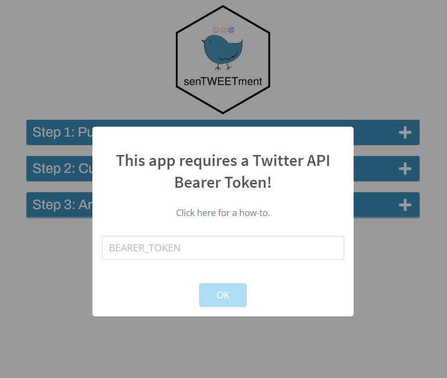
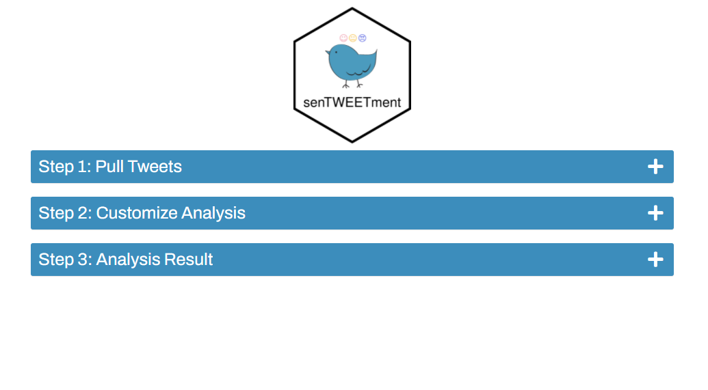
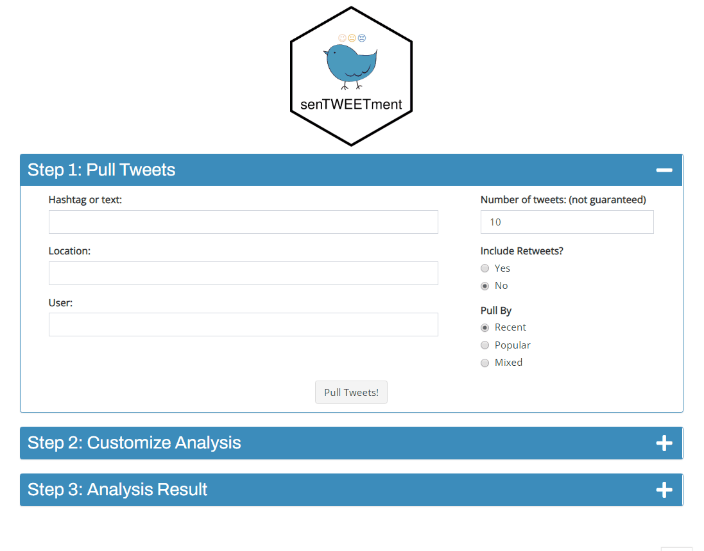
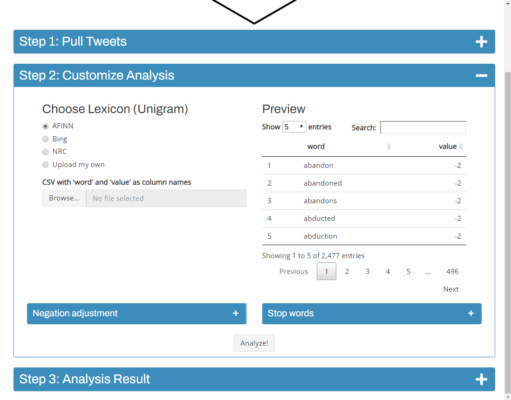
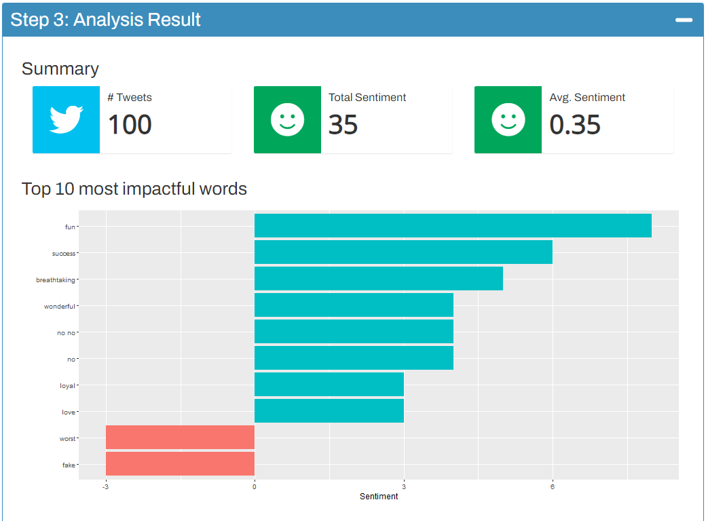
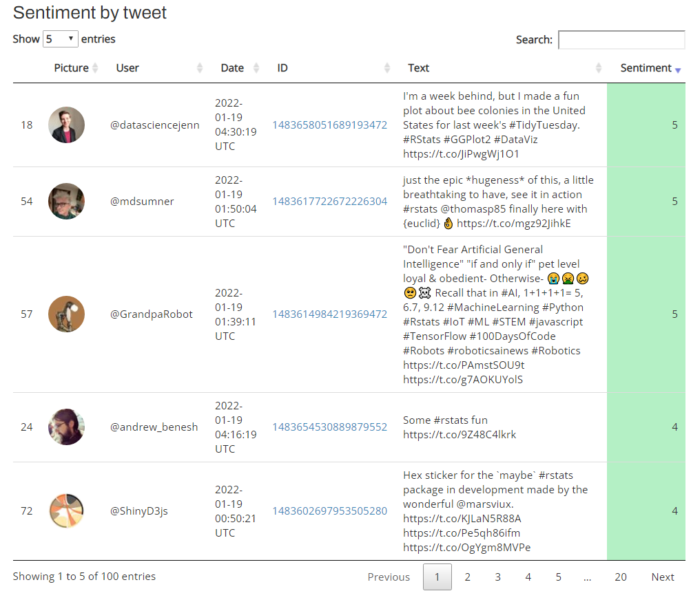
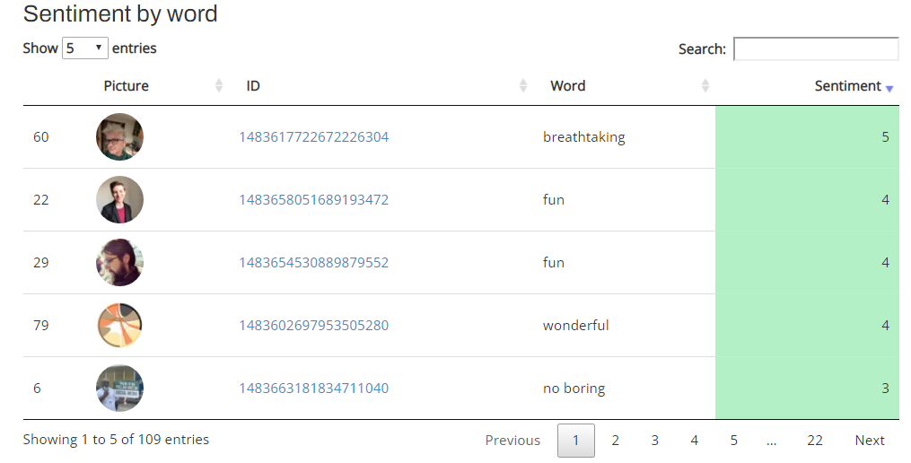

<!-- README.md is generated from README.Rmd. Please edit that file -->

```{r, include = FALSE}
knitr::opts_chunk$set(
  collapse = TRUE,
  comment = "#>",
  fig.path = "man/figures/README-",
  out.width = "100%"
)
```

<!-- badges: start -->
[](https://lifecycle.r-lib.org/articles/stages.html#experimental)
[](https://github.com/jiwanheo/senTWEETment/actions)
<!-- badges: end -->

# senTWEETment 

Inspired heavily by [Text Mining with R](https://www.tidytextmining.com/), senTWEETment is a shiny app that helps you extract and conduct lexicon-based sentiment analysis on tweets in English. The design specification can be found in the [design spec vignette](vignettes/design-spec.Rmd). 

This app is distributed as an R package under the [golem](https://thinkr-open.github.io/golem/) framework. Under the hood, the main business logics are held in an R6 class, allowing for communications between modules.

## Installation

You can install the latest version of senTWEETment from github with:

```{r eval=FALSE}
install.packages("remotes")
remotes::install_github("jiwanheo/senTWEETment")
```

## Setup - lexicons

senTWEETment currently supports 3 pre-set lexicons libraries from [textdata](https://github.com/EmilHvitfeldt/textdata).(AFINN, Bing, NRC). To use them, users must explicitly agree to conditions to downloading/using these lexicons before launching the app for the first time. To do this, run in your console:

```{r eval=FALSE}
senTWEETment::get_lexicons()
```

## Setup - Twitter API

The first time you launch senTWEETment, you'll be prompted to provide a bearer token of your Twitter API app. Setting up the authorization can be found in the [auth vignette](vignettes/auth.Rmd).

{width="548"}

## Usage

To run the application from your local computer, run:

```{r eval=FALSE}
senTWEETment::run_app()
```

The app follows 3 straightforward steps that lead up to a text analysis output.

{width="548"}

### Step 1. Pull Tweets

{width="548"}

On the left hand side, there are 3 inputs that you can search tweets with in one of 4 ways:

- Hashtag or text
- Location
- User
- Hashtag or text AND Location

Any input combinations outside these 4 are automatically disabled.

After choosing a method, you can provide further search options on the right hand side.

- Number of tweets is not guaranteed (tweets may have been deleted, modified, ...)
- Include Retweets is defaulted to "Yes", on user search.
- Pull By is defaulted to "Recent" on user search.

Press "Pull Tweets" to retrieve the tweets in a DT table with links to user profiles and tweets.

### Step 2. Customize Analysis

{width="548"}

In this step, you can specify which lexicons you'll use for the analysis. You can choose between the 3 pre-set lexicons, or upload your own file.

You can also edit the list of negation words and stop words used in this analysis. Further explanation in the [analysis vignette](vignettes/analysis.Rmd).

Once you're happy with the settings of the analysis, press "Analyze!" to run the sentiment analysis.

### Step 3. Analysis Result

The resulting analysis shows

- A summary of tallied-up/per-tweet sentiment
- Top 10 words with most impacts on analysis
- Original Tweets and their sentiments
- Contributing sentiment per word per tweet. (If blank, the tweet didn't have any words with sentiments in the lexicon)

{width="548"}
{width="548"}
{width="548"}
