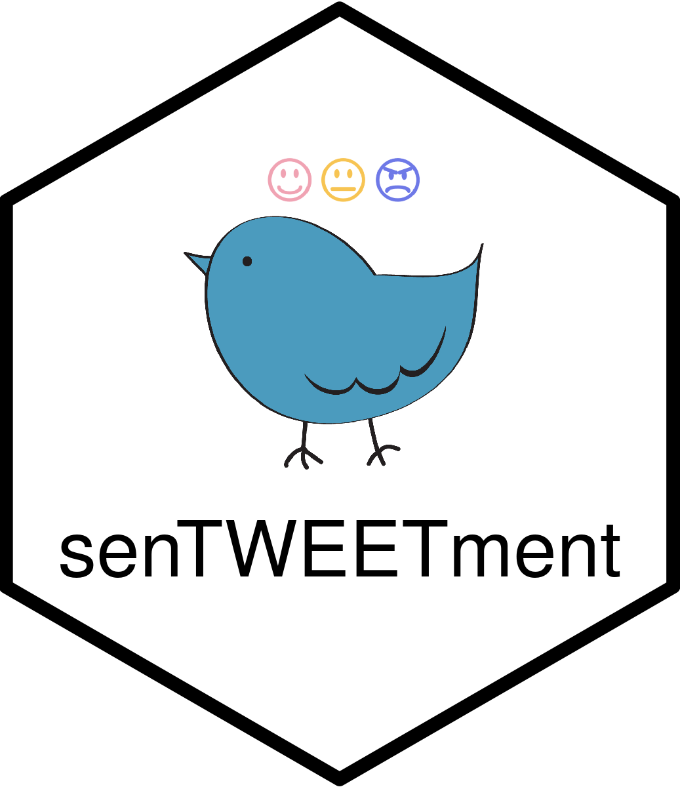
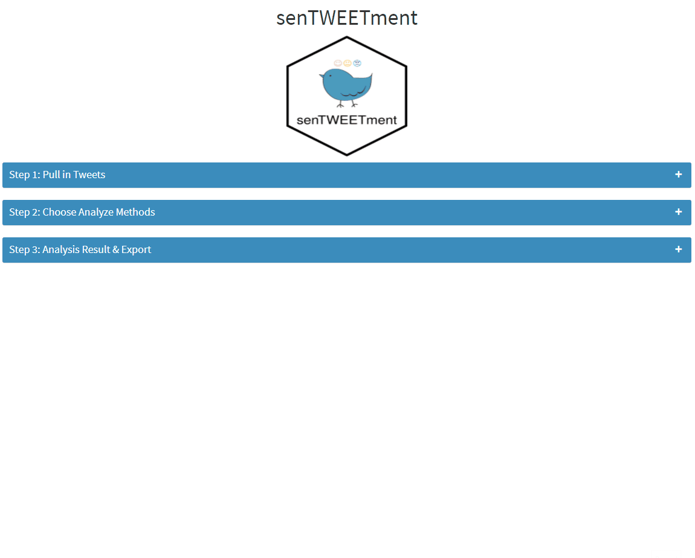

<!-- README.md is generated from README.Rmd. Please edit that file -->

```{r, include = FALSE}
knitr::opts_chunk$set(
  collapse = TRUE,
  comment = "#>",
  fig.path = "man/figures/README-",
  out.width = "100%"
)
```

<!-- badges: start -->
[](https://lifecycle.r-lib.org/articles/stages.html#experimental)
<!-- badges: end -->

# senTWEETment 

## Installation

You can install the latest version of senTWEETment from github with:

``` r
remotes::install_github("jiwanheo/senTWEETment")
```

## Progress



# Design Specs

This app provides an easy interface to analyze twitter sentiment. Users can pull in tweets using hashtags, locations, or specific ID, and conduct text sentiment analysis using various ranking methods. The results should be available for download.

## General Observation

- Straightforward app, everything should be done on 1 page (no tab)

- There are steps to follow, so it'd be nice to have users follow them explicitly, by graying out next steps, before the previous ones are complete


## User experience considerations

- Make it clear the need for API keys (Renvironment & Sys.get)

- Let's make very clear the steps to follow

## Technical points

- Clear communications between steps (modules), when one is done, it should trigger next. If previous steps are modified, subsequent steps should also be modified.

## Concept Map


## Asking Questions

Who are the end users of your app?

- Diverse background of people who need to understand how people react to certain news or events. Examples include online advertisers, social researchers or Twitter influencers.

Are they tech-literate?

- Enough to understand what sentiment analysis means, but no need to understand coding.

In which context will they be using your app?

- To hypothesize and test some ideas around a stimulus event. They will be (in)directly using Twitter sentiment as population sentiment.

On what machines?

- Ideally Laptops/desktop computers. Most likely won't be used on phones. 

What browser version will they be using?

- Given the audience we aim, they will be using recent versions of modern browsers. 

Will they be using the app in their office, on their phone while driving a tractor, in a plant, or while wearing lab coats?

- In the office.

## Personas

Martha Guthrie: Digital Marketing Manager at Weissnat Group

Martha Guthrie is a digital marketing manager at Weissnat Group. She graduated university with a marketing degree, with no knowledge of coding/programming. Weissnat is an e-commerce company that sells various health & well-being products. Recently, Martha's team launched a new campaign initiative, #JustLookUp, which promotes good postures and habits to increase spinal health. With this campaign, Martha hopes to increase sales, by re-branding the company products. She wants to know what the general public thinks of the campaign on Twitter, by scanning through the tweets that mention #JustLookUp hashtag, or the company account @Weissnat.

Thomas Lee: Master's student, Sociology at Belchar University.

Thomas Lee is a master's student at Belchar University. His hometown, Belchar, a small village of 50,000 people, have recently been chosen as the destination for a nuclear plant. As part of his final graduate school project, Thomas is writing a paper, investigating what types of effects this new project has on his hometown. Thomas is conflicted, because on one hand, lots of new jobs will be created. On the other hand, people seem to have concerns around health, and real estate values. In order to quantify this positive & negative emotions, Thomas decided to use Twitter activity around the area, to see if people have generally been in a bad mood.
