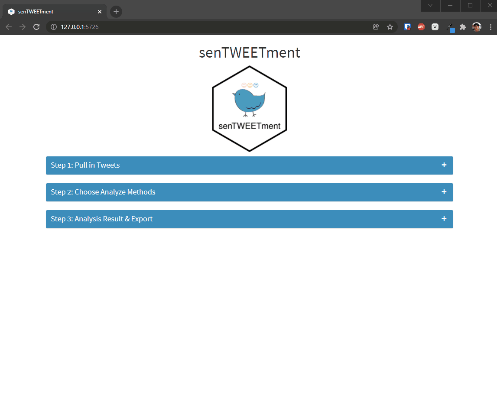

<!-- README.md is generated from README.Rmd. Please edit that file -->
<!-- badges: start -->

[](https://lifecycle.r-lib.org/articles/stages.html#experimental)
<!-- badges: end -->

# senTWEETment 

senTWEETment is a shiny app that helps you extract and conduct sentiment
analysis on tweets. It is distributed as an R package using the
[golem](https://thinkr-open.github.io/golem/) framework.

This tool utilizes the text sentiment analysis process introduced in the
book [Text Mining with R](https://www.tidytextmining.com/). It currently
supports 3 lexicons:

-   AFINN
-   Bing
-   NRC

The design specification of this app can be found in the “design-spec”
vignette (per engineering Shiny book)

## Installation

You can install the latest version of senTWEETment from github with:

``` r
install.packages("remotes")
remotes::install_github("jiwanheo/senTWEETment")

# with vignettes
remotes::install_github("jiwanheo/senTWEETment", build_vignettes = TRUE)
```

## Usage

To run the application from your local computer simply run:

``` r
senTWEETment::run_app()
```

First, you’ll need a Twitter API app. Setting up and authorization can
be found in the auth vignette.

``` r
# vignette("auth")
```

## Progress


