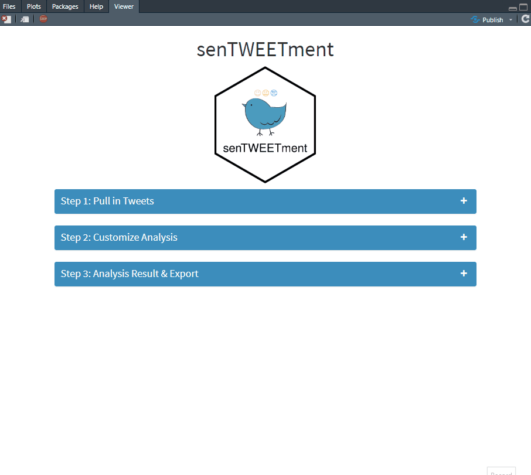

<!-- README.md is generated from README.Rmd. Please edit that file -->
<!-- badges: start -->

[](https://lifecycle.r-lib.org/articles/stages.html#experimental)
<!-- badges: end -->

# senTWEETment 

senTWEETment is a shiny app that helps you extract and conduct sentiment
analysis on tweets. It is distributed as an R package using the
[golem](https://thinkr-open.github.io/golem/) framework.

## Installation

You can install the latest version of senTWEETment from github with:

``` r
install.packages("remotes")
remotes::install_github("jiwanheo/senTWEETment")

# with vignettes
remotes::install_github("jiwanheo/senTWEETment", build_vignettes = TRUE)
```

## Setup - lexicons

senTWEETment utilizes the text sentiment analysis process introduced in
the book [Text Mining with R](https://www.tidytextmining.com/). It
currently supports 3 lexicons libraries (AFINN, Bing, NRC). Before using
this app, users must agree to conditions to downloading/using these
lexicons. To do this, run the following code in the console:

``` r
senTWEETment::get_lexicons()
```

## Setup - Twitter API

The first time you launch senTWEETment, you’ll need to provide a bearer
token of your Twitter API app. Setting up the authorization can be found
in the [auth vignette](vignettes/auth.Rmd).

``` r
vignette("auth")
```

## Usage

To run the application from your local computer simply run:

``` r
senTWEETment::run_app()
```

You can pull tweets in 1 of 4 ways:

-   Search word (\#hashtag or any other text)
-   User name
-   Location
-   Search word + Location

The design specification of this app can be found in the [design spec
vignette](vignettes/design-spec.Rmd) (per engineering Shiny book)

``` r
vignette("design-spec")
```

## Progress


