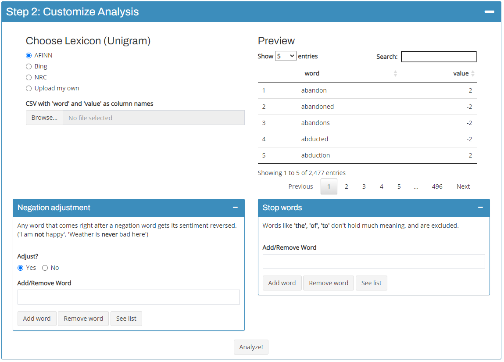

```{r, include = FALSE}
knitr::opts_chunk$set(
  collapse = TRUE,
  comment = "#>"
)
```

## Inputs

{width="548"}

### Lexicons

senTWEETment uses the unigram lexicon-based sentiment analysis, targeted at tweets in the English language.

Firstly, you'll need to choose the sentiment lexicons to work with. There are 3 pre-set libraries from [{textdata}](https://github.com/EmilHvitfeldt/textdata), as well as an option to upload your own csv file, which should have as column names, "word" & "value". (Note that the radiobutton should be on "Upload my own").

- **AFINN**: not processed.
- **bing**: "negative" / "positive" sentiments assigned -1 / 1 as values.
- **nrc**: filtered on "negative" / "positive" sentiments, and assigned -1 / 1 as values.

### Negation Adjustment & Stop Words

Here, you can see and edit the list of words used for negation adjustments and stop words removal. No action is required, if you're happy with the defaults and you want to do the negation adjustment.

- **Negation words**: Words that can reverse the sentiment of the following word. ("Not bad", "Never funny")
- **Stop words**: Words without real meaning, that are used to construct sentences. ("to", "a", "of")

We'll see what these words do in the [Analysis process](#analysis-process) section.

## Analysis process

The entire process is heavily inspired by [Tidy Text Mining with R](https://www.tidytextmining.com/index.html).  Let's use a sample tweet to illustrate the process.

```{r echo = FALSE, warning = FALSE, message = FALSE}
sample_tweet <- data.frame(
  Text = "Not that much damage from yesterday's disaster"
)
```

```{r}
sample_tweet
```

Firstly, the tweets are tokenized into unigrams

```{r echo = FALSE, message = FALSE, warning = FALSE}
library(magrittr)
tokenized <- sample_tweet %>% 
  tidytext::unnest_tokens(word, Text, token = "tweets")
```

```{r}
tokenized
```

Secondly, stop words are removed.

```{r echo = FALSE}
stop_words <- tidytext::stop_words

tokenized_stopped <- tokenized  %>%
  dplyr::filter(!word %in% stop_words$word,
                !word %in% gsub("'", "", stop_words$word),
                grepl("[a-z]", word))
```

```{r}
tokenized_stopped
```

This is then inner joined with the lexicon

```{r echo = FALSE}
lexicons <- tibble::tibble(
  word = c("damage", "disaster"),
  value = c(-3, -2)
)

sentimented <- tokenized_stopped %>%
  dplyr::inner_join(lexicons, by = "word")
```

```{r}
sentimented
```

Now we stop for a second, and decide whether to carry out negation adjustment or not. 

If we don't do it, the analysis ends here. The scores can be tallied up, to determine the sentiment of tweets.

```{r}
sentimented %>% 
  dplyr::summarize(value = sum(value))
```

If we decide to do it, we leave `sentimented` here for now, and come back to it later.

### Negation Adjustment.

The purpose of this adjustment is to better capture the sentiments of texts by using bigrams. From the above text:

> Not that much damage from yesterday's disaster

Firstly, we turn this into a sequence of unigrams, and filter out the stop words.

> "Not" "damage" "yesterday's" "disaster"

Secondly, we move our way through the sentence, to make 2-word sequences.

> "Not damage" "damage yesterday's" "yesterday's disaster"

Then, we look to see if any of the new sequence starts with a negation word, and drop the rest.

> "Not damage"

From here, we look up the sentiment of the second word, "damage" in the lexicon. If found, reverse the sentiment value, and add it back to the original sentiment.

We do this by creating a tibble below,

```{r}
negation_result <- tibble::tibble(
  word = c("Not damage", "damage"),
  value = c(3, 3)
)
```

appending it to the original sentiment,

```{r}
sentimented %>% 
  rbind(negation_result)
```

and summing up at the word level.

```{r}
sentimented %>% 
  rbind(negation_result) %>% 
  dplyr::group_by(word) %>% 
  dplyr::summarize(value = sum(value), .groups = "drop")
```

This adjustment turns what was originally a negative tweet, to a positive one!

The rest of this app, is just a couple different fun ways to visualize the analysis outlined here.

## Developer's notes

The negation adjustment often clashes with stop words. One problem is that most negation words are already found in stop words. This is solved by removing those negation words from the list of stop words. 

Another critical flaw is that it can result in negating something undesirable. Take this sentence.

> I'm not saying that improving sleep is a must, but it'd be nice.

This sentence has generally a positive tone, because the word 'not' doesn't really mean much here. It is just used as a casual setup to the real meaning behind the sentence, "It'd be nice to improve sleep". However, our lexicon-based negation adjustment turns this into:

> "not improving" "nice"

... and evaluate them separately. (-2 + 3 = 1 on AFINN)

So, yes. There exist some shortcomings of mostly unigram lexicon-based approach of senTWEETment. I still think this basic level analysis offers something useful.
