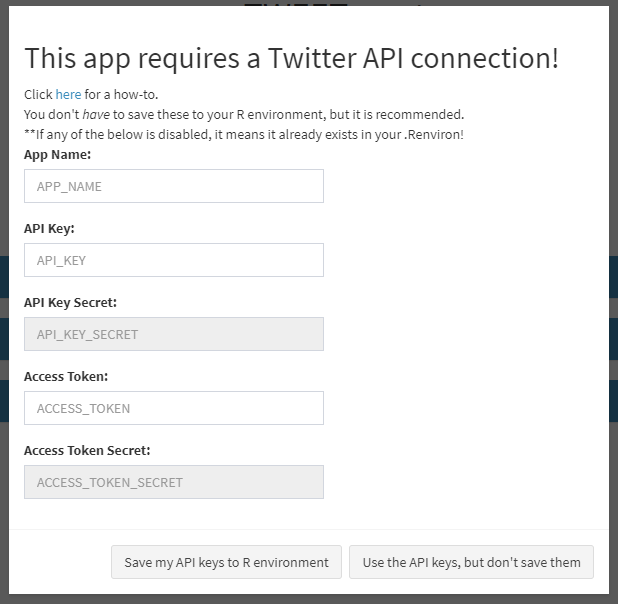
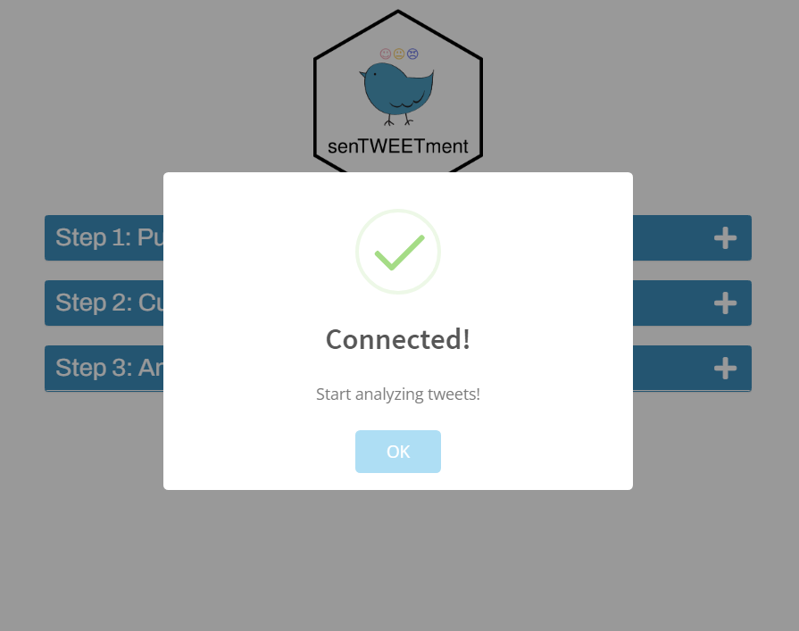

```{r, include = FALSE}
knitr::opts_chunk$set(
  collapse = TRUE,
  comment = "#>"
)
```

senTWEETment uses the [Twitter Developer API](https://developer.twitter.com/en) to extract various tweets to be analyzed. To get started, you'll need to set up your Twitter "app". You can follow along rtweet package's [auth vignette](https://cran.r-project.org/web/packages/rtweet/vignettes/auth.html), which does an amazing job of outlining this process very thoroughly.

senTWEETment uses the [access token/secret method](https://cran.r-project.org/web/packages/rtweet/vignettes/auth.html#access-tokensecret-method) to connect your Twitter App. This means you'll need to provide the following:

- App name
- Consumer API key
- Consumer API key secret
- Access token
- Access token secret

If you don't have these keys saved in your .Renviron, the app will ask for them.

{width="548"}

In case you have some of the credentials saved, the app won't ask for them again.

{width="548"}

Once you have filled out the information, you can either save the credentials to your user-specific .Renviron (recommended, so the app knows where to look for them, the next time it opens), or simply use them without saving.

If you see this prompt, you are good to go!

{width="548"}

## Developer's notes

When the app is launched, it will look for the Twitter token & API Keys in the R environment (`mod_main`). If not found, the modalBox will open, asking for them. (`mod_creds_modal`) 

`get_creds()` is called every time an app is launched

- Scenario A: user already has API keys saved in env. 
  - Awesome, it will `Sys.get()` and return them.
  - Enter `connect_to_api()` from `mod_main_server()`
- Scenario B: user doesn't have API keys saved, but saves them in the modalBox. 
  - Good, hitting "Save the creds to R environment" button should trigger `get_creds()` again.
  - Enter `connect_to_api()` from `mod_creds_modal_server()` observeEvent( input$save_creds)
- Scenario C: user doesn't have API keys saved, and doesn't save them in the modalBox 
  - Not ideal. hitting "Use the creds, but don't save them" button should trigger `get_creds()` again, but this time, the API keys are passed, and literally just returns it. 
  - Enter `connect_to_api()` from `mod_creds_modal_server()` observeEvent( input$just_use_creds)

Also, if user partially has the creds filled (1 missing), I can have `get_creds()` return that field, and call mod_creds_modal with it as an argument, and have the rest of the creds greyed out.

- Had to use a "fake" `reactiveVal` that is listened by a init-trigger-watch. (the 5 input boxes are disabled by default, and we enable only the necessary ones - requiring server to update UI)

- If their creds are wrong, we'll redirect them here, with all 4 boxes open?
