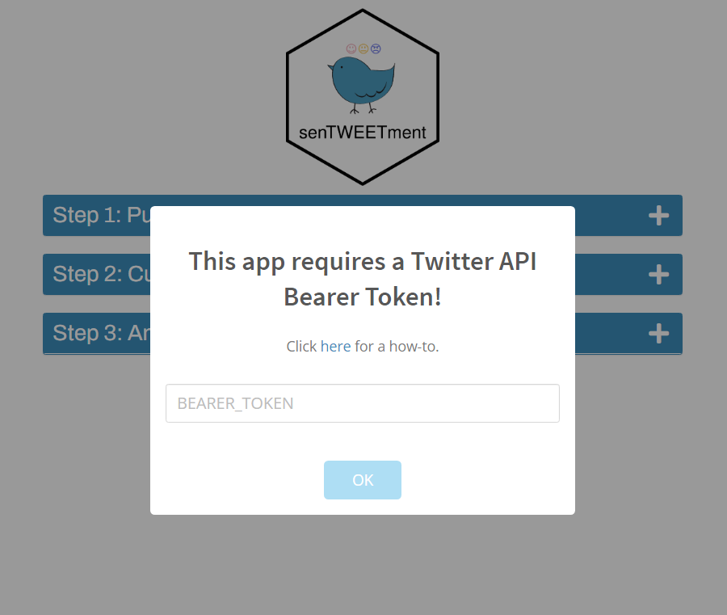

```{r, include = FALSE}
knitr::opts_chunk$set(
  collapse = TRUE,
  comment = "#>"
)
```

senTWEETment uses the [Twitter Developer API](https://developer.twitter.com/en) to extract various tweets to be analyzed. To get started, you'll need to set up your Twitter "app". 

## Creating a Twitter app

There's a good chance you're probably already on Twitter. If this is the first time you're using Twitter programmatically from R, there's an important concept that you need to understand.

It's that every time you use Twitter API, it has to go through an "app".

In every day situation, you use that app that Twitter put together, but now that you're trying to do a litle more than the usual, you need to create your own app.

You'll want to apply for a developer account by following the instructions at <https://developer.twitter.com>.

Give it some time, and once you're approved, go to the [developer portal](https://developer.twitter.com/en/portal/projects-and-apps) and click the "Create App" button.

Name your app: the name is unimportant for our purposes, but needs to be unique across all twitter apps.

After you've created your app, go to the "Projects & Apps" page, and generate a "Bearer Token", and save it somewhere.
{width="548"}

## Setup

The first time you launch senTWEETment, it'll ask for that bearer token to connect to your Twitter app. 

{width="548"}

Once you have filled it out and click "OK", you'll be authenticated, and the connection will be saved, so the next time you launch senTWEETment, you don't have to do this.

If you see this prompt, you are good to go!

{width="548"}

## Developer's notes

When the app is launched, it will run the following, which tries to authenticate, and if not, ask the user for the token.

```{r eval = FALSE}
tryCatch({
  auth_as("my-twitter-app")
}, error = function(e) {
  mod_creds_modal_server("creds_modal_1")
})
```

- If their creds are wrong, we'll redirect them here, with all 4 boxes open?
