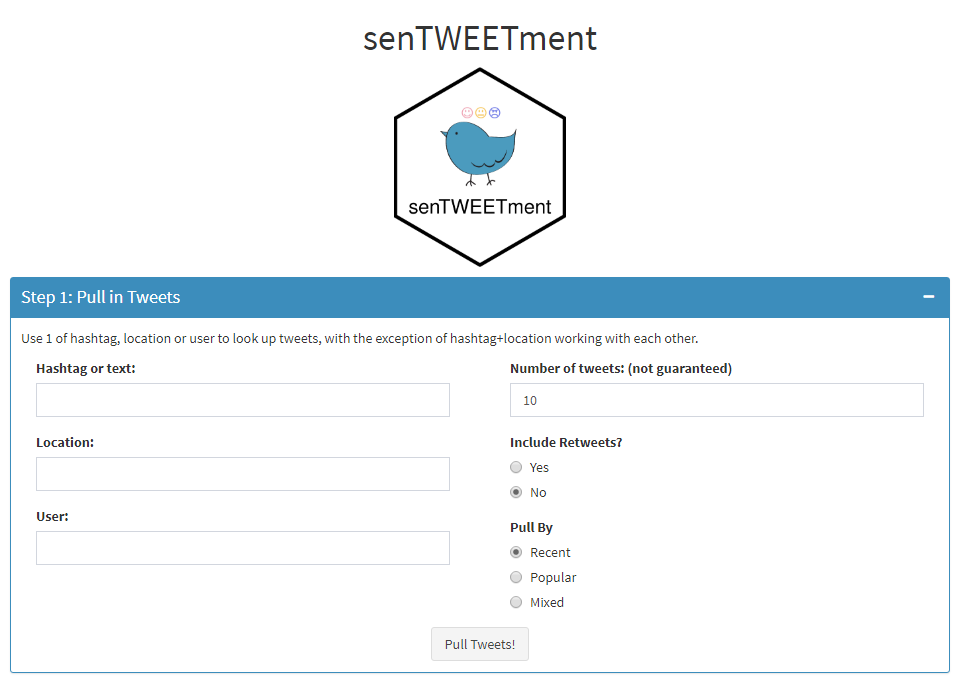
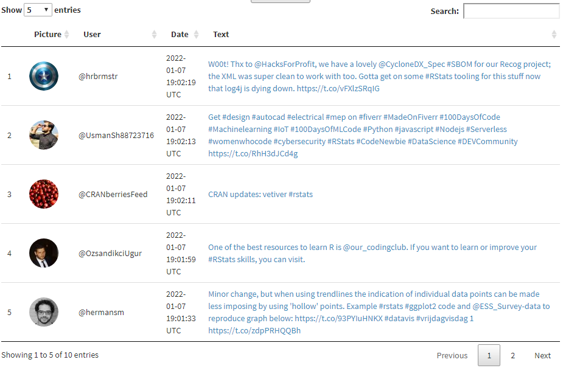

```{r, include = FALSE}
knitr::opts_chunk$set(
  collapse = TRUE,
  comment = "#>"
)
```

After authenticating, you have 4 options to pull in tweets using inputs on the left hand side.

- Hashtag or text
- Location
- User
- Hashtag or text AND Location

{width="548"}

The right side panel gives more flexibility to the search query. Some notes:

- Number of tweets is not guaranteed. 
> You are not guaranteed to get exactly `n` results back. You will get fewer results when tweets have been deleted or if you hit a rate limit. You will get more results if you ask for a number of tweets that's nota multiple of page size, e.g. if you request `n = 150` and the page size is 200, you'll get 200 results back.

- When searching by user, "Include Retweets" is defaulted to "Yes", and "Pull By" to "Recent", and are disabled from user input.

The location search is enabled by [nominatim geocoding API](https://nominatim.org/). They ask you to limit your request to a moderate level (60 per minute), please be mindful.

{width="548"}

The resulting tweets are shown as above. The profile picture links to the user's profile, and the text links to the tweet itself.
