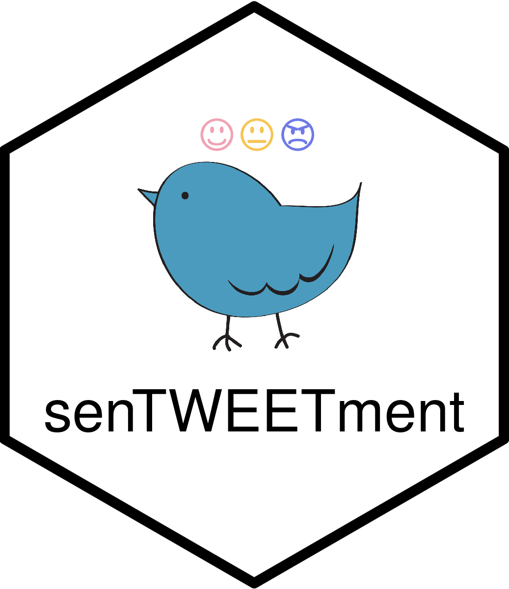

```{r, include = FALSE}
knitr::opts_chunk$set(
  collapse = TRUE,
  comment = "#>"
)
```

{width=200px, height=200px}

{senTWEETment} is a shiny app that provides an easy interface to analyze twitter sentiment. Users can pull in tweets using hashtags, locations, user ID, or tweet ID, and conduct text sentiment analysis using various ranking methods. 

Like other Shiny apps, `run_app()` starts the app.

```{r setup, eval=FALSE}
library(senTWEETment)
run_app()
```

# Connecting to Twitter Dev API

[Twitter Dev API](https://developer.twitter.com/en) is required to use this app. They do require you to have a Twitter account, but the setup is straightforward. Take note of your consumer keys & authentication tokens somewhere.

When the app is launched, it will look for the 4 Twitter API Keys in the R environment (`mod_main`). If not found, the modalBox will open, asking for them. (`mod_creds_modal`) The modal asks the user to supply the keys. The users have the option of either saving the them in environment (so next time, it won't open), or just use the creds they provided without saving. (modalBox will open next time)

## Getting API credentials

`get_creds()` is called every time an app is launched

- Scenario A: user already has API keys saved in env. 
  - Awesome, it will `Sys.get()` and return them.
  - Enter `connect_to_api()` from `mod_main_server()`
- Scenario B: user doesn't have API keys saved, but saves them in the modalBox. 
  - Good, hitting "Save the creds to R environment" button should trigger `get_creds()` again.
  - Enter `connect_to_api()` from `mod_creds_modal_server()` observeEvent( input$save_creds)
- Scenario C: user doesn't have API keys saved, and doesn't save them in the modalBox 
  - Not ideal. hitting "Use the creds, but don't save them" button should trigger `get_creds()` again, but this time, the API keys are passed, and literally just returns it. 
  - Enter `connect_to_api()` from `mod_creds_modal_server()` observeEvent( input$just_use_creds)

Also, if user partially has the creds filled (1 missing), I can have `get_creds()` return that field, and call mod_creds_modal with it as an argument, and have the rest of the creds greyed out.
- Had to use a "fake" `reactiveVal` that is listened by a init-trigger-watch. (the 4 input boxes are disabled by default, and we enable only the necessary ones - requiring server to update UI)
- If their creds are wrong, we'll redirect them here, with all 4 boxes open?
